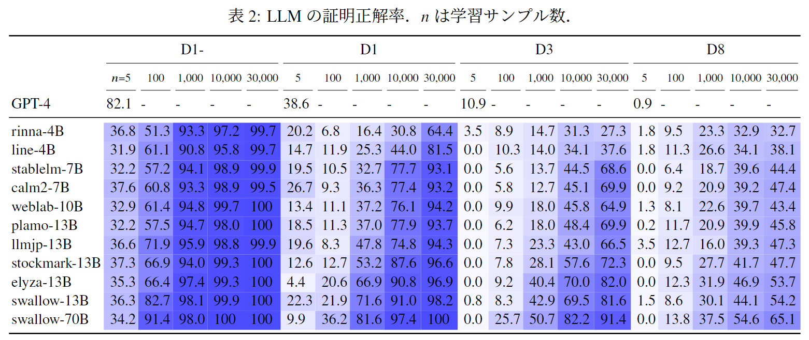

# Japanese Formal Logic Deduction Corpus


## コーパスリスト

* [JFLD](https://huggingface.co/datasets/hitachi-nlp/JFLD)
    - **正式版です．**
    - 言語処理学会の予稿で用いられたコーパスの日本語表現を，より自然にしたものです．具体的には:
        * 予稿版では語彙としてmecab辞書を使っており，古風な単語・人名などが含まれていた．正式版では，現代的な語句(BCCWJの高頻度語句)を用いている．
        * 論理式から日本語への変換に用いられるテンプレートの改善．
        * 活用などの後処理モジュールの実装．
        * 不自然な命題論理由来の表現を削除．
    - LLMの性能値に関しては，予稿版と正式版で大きな差はありません(実測値は[後述](#LLMの性能評価))．
        * 予稿版と正式版の違いは日本語表現の自然さ程度にすぎず，それは論理の本質には影響しない(*)からです．
* [JFLD_NLP_2024_proceeding_reproduction](https://huggingface.co/datasets/hitachi-nlp/JFLD_NLP_2024_proceeding_reproduction)
    * 予稿版です．すなわち，言語処理学会の予稿で用いられたコーパスです．再現性のために残しておきます．
* [JFLD_punipuni_monster](https://huggingface.co/datasets/hitachi-nlp/JFLD_punipuni_monster)
    * おまけ版です．基本的に正式版と同じですが，主語が...．


(*)... 実は，LLMのような帰納的な機械の学習・評価を念頭に置くと，「言語表現の表層的な違いは本質的ではない」と簡単に切り捨てられない事情も出てきます．もし本当に表層が本質的でないのなら，そもそも日本語への変換などせずに，論理式のままのコーパスでこと足りると思いますよね．しかし，LLMは(あまり大胆に帰納しない)帰納的な機械なので，例えば論理式のコーパスで学習すると，論理式で書かれた論理推論タスクは解けるが，日本語で書かれた論理推論タスクは解けない，ということが起こりえます．詳しくは，予稿のAppendix.2を参照してください．それはそれとして，いずれにせよ，本コーパスをLLMの評価に用いる場合は，[LLMの性能評価](#LLMの性能評価)を参照して貰えればよいと思います．


## 使い方
コーパスのロード方法は，[英語版の説明](./README.md#How_to_use_the_corpora)を読んでください．
学習・評価用のコードなどは，[FLDプロジェクトのトップページ](https://github.com/hitachi-nlp/FLD)から辿ってください．


## LLMの性能評価
* (TBD) JFLD
* JFLD_NLP_2024_proceeding_reproduction
    - 
* (TBD) JFLD_punipuni_monster


## JFLDのサンプルってどんな感じ？
JFLDのサンプルは，演繹推論を表したサンプルです．
演繹推論では，与えられた事実(`facts`)を基に，与えられた仮説(`hypothesis`)を証明あるいは反証するための論理ステップ(`gold proof`)を生成します．
詳しくは，[英語版の説明](./README.md#What_does_the_dataset_example_look_like?)で確認してください．

`JFLD_punipuni_monster`に含まれる演繹推論サンプルは以下のような感じです:


FLD・JFLDに共通する設計方針として **「知識と切り分けられた純粋な論理推論能力を計測するため，文がランダムに構成されている**(*)ということが挙げられます．なぜこれが必要か．LLMの事前学習コーパスは巨大であるため，そこには多くの論理推論問題が含まれています．よって，もし仮にLLMが「地球は太陽を周回している．もし(地軸が傾いている)惑星が太陽を周回していれば，そこには四季がある．」「よって地球には四季がある．」というような"定型的な"推論問題を解けたたとしても，それが果たして **本当に推論ができるから解けた**のか，あるいは **事前学習コーパスに含まれる同様の問題を知識として丸暗記しており，その答え出力しているだけ**なのか，が切り分けられないのです．実際，後者のような挙動も複数，観測されているようです．詳しくは予稿を参考にしてください．


(*)... もちろん，論理構造を除いて，という意味です．


## Citation
```bibtex
@article{morishita_2024_NLP_JFLD,
  title={日本語論理推論ベンチマークJFLDの提案},
  author={森下皓文 and 山口篤季 and 森尾学 and 角掛正弥 and 友成光 and 今一修, and 十河泰弘},
  journal={言語処理学会 第30年次大会 発表論文集},
  abbr={言語処理学会},
  year={2024}
}
```
