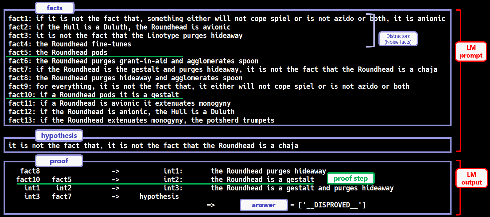

# FLD Corpus
This repository includes the released FLD corpora.

See [the entry-point repository](https://github.com/hitachi-nlp/FLD.git) about the whole FLD project.

## Available Corpora
* The English corpora introduced in the ICML paper are:
    * [**FLD** (FLD.3)](https://huggingface.co/datasets/hitachi-nlp/FLD.v2/viewer/default/train)
    * [**FLD★**(FLD.4) ](https://huggingface.co/datasets/hitachi-nlp/FLD.v2/viewer/star/train)

Note that these corpora are version 2.0, which is detailed in the Appendix.H of our paper.

* The Japanese corpora, or **JFLD**, are described [here](./README.JFLD.md).

## How to use the corpora
First, install the datasets library:
```console
pip install datasets
```

Then, you can load the FLD corpora as follows:
```python
from datasets import load_dataset
FLD = load_dataset('hitachi-nlp/FLD.v2', name='default')
FLD_star = load_dataset('hitachi-nlp/FLD.v2', name='star')
```

## What does the dataset example look like?

### Overview
An example of deduction in our dataset is conceptually illustrated in the figure below:



That is, given a set of facts and a hypothesis, a model must generate a proof sequence and determine an answer marker (proved, disproved, or unknown).

### Schema
The most primitive fields are:
* `context` (or `facts` in the latest version): A set of facts.
* `hypothesis`: A hypothesis.
* `proofs`: Gold proofs. Each proof consists of a series of logical steps derived from the facts leading towards the hypothesis. Currently, for each example, we have at most one proof.
* `world_assump_label`: An answer, which is either `PROVED`, `DISPROVED`, or `UNKNOWN`.

Additionally, we have preprocessed fields as follows:
* `prompt_serial`: A serialized representation of the facts and the hypothesis.
* `proof_serial`: A serialized representation of the proof and answer.

To train or evaluate a Language Model (LM), one can take one of two approaches:
* Use `prompt_serial` as input and `proof_serial` as output. This will make the LM to generate both the proof and the answer.
* Use `prompt_serial` as input and `world_assump_label` as output. This will make the LM to generate only the answer.
