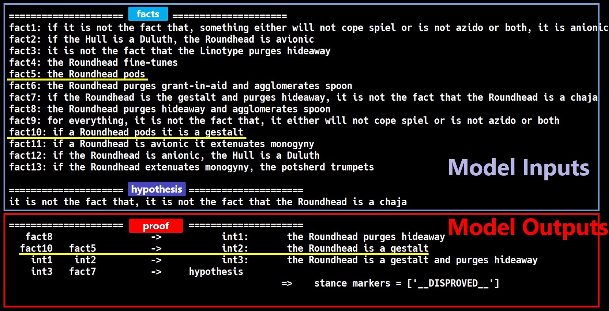

# FLD Corpus
This repository includes the released FLD corpora.

See [the entry-point repository](https://github.com/hitachi-nlp/FLD.git) about the whole FLD project.

## About this release
* This is version 2.0 of FLD corpora with improved natural language template quality, logical proof consistency, and harder distractors. These corpora are slightly different from those used in the paper.

## The released corpora
The corpora are released on 🤗 the huggingface hub.
Currently, we have released two corpora:
* [**FLD** (FLD.3)](https://huggingface.co/datasets/hitachi-nlp/FLD.v2), which includes lower depth proof trees.
* [**FLD★**(FLD.4) ](https://huggingface.co/datasets/hitachi-nlp/FLD-star.v2), which includes hihger depth proof trees.

Or, you can manually download [the source files](https://drive.google.com/file/d/1BcI8lp3ye6vxOoRmcd_ORawytWQnH2yO/view?usp=sharing).

## Deduction examples
A deduction example in our corpora is conceptually as depicted in the following figure:

For how to use such examples for training language models, see [the prover repository](https://github.com/hitachi-nlp/FLD-prover/).
