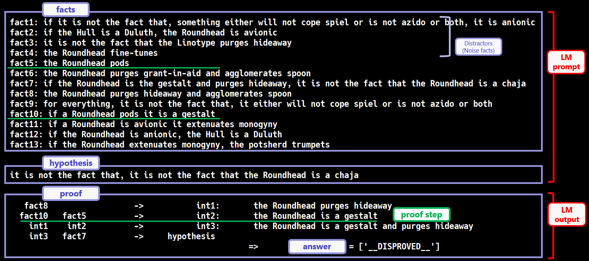

# FLD Corpus
This repository includes the released FLD corpora.

See [the entry-point repository](https://github.com/hitachi-nlp/FLD.git) about the whole FLD project.

## Available Corpora
* **(NEW!)** **[FLDx2 (Formal Logic Deduction Diverse)](https://huggingface.co/datasets/hitachi-nlp/FLDx2), our newest and the most advanced corpus**, which substantially improves the reasoning capability of LLMs. Published alongside [our NeurIPS 2024 paper](https://arxiv.org/abs/2411.12498).
* JFLD, the Japanese version of FLD, described [here](./README.JFLD.md). Published alongside [our LREC-COLING 2024 paper](https://aclanthology.org/2024.lrec-main.832/).
* The first FLD corpora, [FLD (FLD.3)](https://huggingface.co/datasets/hitachi-nlp/FLD.v2/viewer/default/train) and [FLD★ (FLD.4) ](https://huggingface.co/datasets/hitachi-nlp/FLD.v2/viewer/star/train), published alongside [our ICML 2023 paper](https://arxiv.org/abs/2308.07336).
    * Note that these are version 2.0, described in the Appendix.H.

## How to use the corpora
First, install the datasets library:
```console
pip install datasets
```

Then, you can load the FLD corpora as follows:
```python
from datasets import load_dataset
FLD = load_dataset('hitachi-nlp/FLDx2', name='default')
```

## What does the dataset example look like?

### Concept
An example of deduction example in our dataset is conceptually illustrated in the figure below:



That is, given a set of facts and a hypothesis, a model must generate a proof sequence and determine an answer marker (proved, disproved, or unknown).

### Schema

The most important fields are:
* `context` (or `facts` in the later version of corpora): A set of facts.
* `hypothesis`: A hypothesis.
* `proofs`: Gold proofs. Each proof consists of a series of logical steps derived from the facts leading towards the hypothesis. Currently, for each example, we have at most one proof.
* `world_assump_label`: An answer, which is either `PROVED`, `DISPROVED`, or `UNKNOWN`.

To train an LLM:
* Use `prompt_serial` for the prompt, which is the serialized representation of the facts and the hypothesis.
* Use `proof_serial` for the output to be generated, which is the serialized representation of the proof and answer.
    - Note that, for the FLDx2 corpus, `proof_serial` sometimes includes both the proof and answer, and sometimes only the answer, working as a sort of augmentation.

For more about the training, see [the training repository](https://github.com/hitachi-nlp/FLD-prover).

The actual schema can be viewed on [the huggingface hub](https://huggingface.co/datasets/hitachi-nlp/FLDx2).
